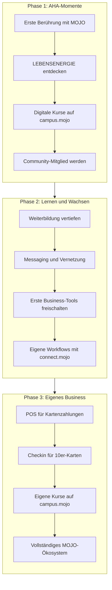
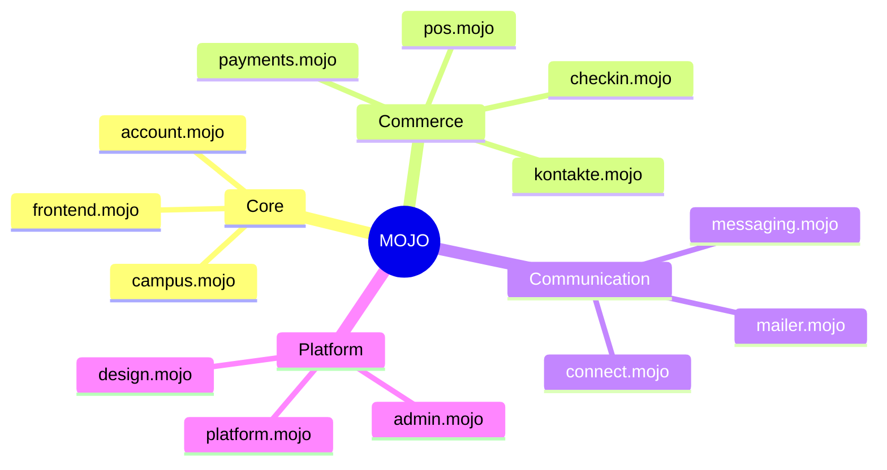
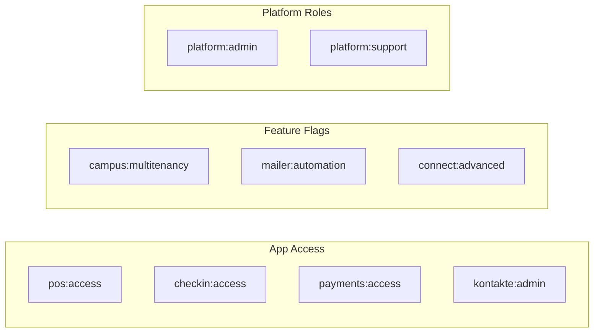

# MOJO Ökosystem

> **System für chronische Gesundheit** – Die zentrale Dokumentation für das gesamte MOJO-Ökosystem

**Version:** 2.0.0  
**Letzte Aktualisierung:** 01. Januar 2026

---

## Inhaltsverzeichnis

1. [Vision und Mission](#1-vision-und-mission)
2. [User Journey](#2-user-journey)
3. [App-Katalog](#3-app-katalog)
4. [Architektur](#4-architektur)
5. [Entitlement-System](#5-entitlement-system)
6. [Technologie-Stack](#6-technologie-stack)
7. [Coding Standards](#7-coding-standards)
8. [Referenzen](#8-referenzen)

---

## 1. Vision und Mission

### Die übergeordnete Vision

Das MOJO-Ökosystem ist ein **System für chronische Gesundheit**. Es empowert Gesundheitsprofessionals auf ihrer Transformation:

```
Von: Erschöpfter, ineffektiver Angestellter
Zu:  Freier, wirksamer, selbstbestimmter Profi
```

### Das LEBENSENERGIE-Konzept

Im Zentrum steht das Konzept der **LEBENSENERGIE** – die fundamentale Kraft, die Menschen befähigt, ihr volles Potenzial zu entfalten. Durch erste AHA-Momente entdecken User ihre eigene LEBENSENERGIE und beginnen eine transformative Reise.

### Die einheitliche Journey

Das MOJO-Ökosystem bietet eine **einheitliche Journey**, die von ersten AHA-Momenten für die eigene LEBENSENERGIE in das Stück-für-Stück-Empowerment für ein eigenes Gesundheitsbusiness führt.

**Kernprinzipien:**

- **Progressive Freischaltung:** Apps, Kurse und Capabilities werden über 1-3 Jahre schrittweise freigeschaltet
- **Gamification:** User "spielen sich frei" durch das Ökosystem
- **Ganzheitliche Begleitung:** Von der Selbsterkenntnis bis zum eigenen Business

### MOJO-Terminologie

| Begriff | Bedeutung |
|---------|-----------|
| **LEBENSENERGIE** | Die fundamentale Kraft für volles Potenzial |
| **AHA-Moment** | Erste Berührung mit dem MOJO-Konzept |
| **Transformation** | Die Reise vom Angestellten zum freien Profi |
| **Freischalten** | Progressive Aktivierung von Features (nicht "kaufen") |
| **Level** | Fortschrittsstufe in der User Journey |

→ Vollständiges Glossar: [MOJO_GLOSSARY.md](./brand/MOJO_GLOSSARY.md)

---

## 2. User Journey

### Übersicht der drei Phasen



### Phase 1: AHA-Momente (Monate 1-6)

**Ziel:** Erste Berührung mit dem LEBENSENERGIE-Konzept und Einstieg in die Community

| App | Funktion | Zugang |
|-----|----------|--------|
| frontend.mojo | Entdeckung und Information | Öffentlich |
| campus.mojo | Erste Kurse und Lerninhalte | Nach Registrierung |
| account.mojo | Eigenes Konto verwalten | Nach Registrierung |
| messaging.mojo | Community-Austausch | Basis-Features |

**Meilensteine:**
- ✓ Account erstellt
- ✓ Ersten Kurs abgeschlossen
- ✓ Erste Community-Interaktion

### Phase 2: Lernen und Wachsen (Monate 6-18)

**Ziel:** Vertiefung des Wissens und Aufbau des eigenen Netzwerks

| App | Funktion | Zugang |
|-----|----------|--------|
| campus.mojo | Erweiterte Kurse und Zertifizierungen | Subscription |
| kontakte.mojo | Erste Kontaktverwaltung | Nach Freischaltung |
| mailer.mojo | Eigene E-Mail-Listen aufbauen | Nach Freischaltung |
| connect.mojo | Erste Automatisierungen | Nach Freischaltung |

**Meilensteine:**
- ✓ Zertifizierung abgeschlossen
- ✓ Eigenes Netzwerk aufgebaut (min. 50 Kontakte)
- ✓ Erste E-Mail-Kampagne gestartet

### Phase 3: Eigenes Business (Monate 18-36)

**Ziel:** Vollständiges eigenes Gesundheitsbusiness mit allen Tools

| App | Funktion | Zugang |
|-----|----------|--------|
| pos.mojo | Kartenzahlungen an der Theke | Business-Subscription |
| checkin.mojo | 10er-Karten-System für eigene Kurse | Business-Subscription |
| payments.mojo | Vollständige Zahlungs- und Rechnungsverwaltung | Business-Subscription |
| campus.mojo (Multitenancy) | Eigene digitale Kurse veröffentlichen | Creator-Subscription |

**Meilensteine:**
- ✓ Erste Zahlung über POS erhalten
- ✓ Erste 10er-Karte verkauft
- ✓ Eigenen Kurs auf campus.mojo veröffentlicht

---

## 3. App-Katalog

### Übersicht aller Apps



### Core Apps

Diese Apps sind für alle authentifizierten User verfügbar.

| App | Domain | Beschreibung |
|-----|--------|--------------|
| **account.mojo** | account.mojo-institut.de | Zentrale Accountverwaltung für das gesamte Ökosystem. Hier verwalten User ihre persönlichen Daten, Subscriptions und verknüpften Organizations. |
| **campus.mojo** | campus.mojo-institut.de | Learning-Plattform, auf der jeder als User beginnt. Mit Multitenancy-Support können fortgeschrittene User eigene digitale Kurse launchen. |
| **frontend.mojo** | mojo-institut.de | Das Marketing-Frontend – die öffentliche Visitenkarte des MOJO-Instituts. Hier entdecken neue User das Ökosystem. |

### Commerce & Payments

Tools für das eigene Gesundheitsbusiness.

| App | Domain | Beschreibung |
|-----|--------|--------------|
| **payments.mojo** | payments.mojo-institut.de | Zentraler Payment Hub um Zahlungen entgegenzunehmen, Rechnungen zu erstellen und zu verwalten. Unterstützt Subscriptions und Einmalzahlungen. |
| **kontakte.mojo** | kontakte.mojo-institut.de | Zentrale Kontaktdatenbank (Single Source of Truth) für Leads, Kunden und Partner (Affiliates). CRM-Funktionalität für das eigene Business. |
| **pos.mojo** | pos.mojo-institut.de | Point of Sale – simpel an der Theke Zahlungen per Karte entgegennehmen. Perfekt für Präsenz-Angebote. |
| **checkin.mojo** | checkin.mojo-institut.de | Verwaltung von 10er-Karten für das erste eigene Kurssystem. Einfacher Einstieg ins Business mit physischen Angeboten. |

### Communication & Automation

Verbindung und Automatisierung.

| App | Domain | Beschreibung | Powered by |
|-----|--------|--------------|------------|
| **messaging.mojo** | messaging.mojo-institut.de | Zentrales Messaging um alle Menschen im MOJO-Ökosystem miteinander zu verbinden. Echtzeit-Kommunikation via WebSocket. | Eigenentwicklung |
| **mailer.mojo** | mailer.mojo-institut.de | E-Mail-Marketing für Mailserien, Newsletter und automatisierte Kampagnen. | Mautic |
| **connect.mojo** | connect.mojo-institut.de | Eigene Workflows erstellen und automatisieren. Verbindet alle MOJO-Apps untereinander und mit externen Services. | n8n |

### Platform Infrastructure

Die technische Basis des Ökosystems.

| App | Domain | Beschreibung |
|-----|--------|--------------|
| **platform.mojo** | – | Zentrale Dokumentation, Templates, Scripts und Shared Packages für alle MOJO Apps. |
| **design.mojo** | design.mojo-institut.de | Zentraler Design Hub mit dem `@gkeferstein/design` Package. Sorgt für eine einheitliche UI/UX-Erfahrung über alle Apps hinweg. |
| **admin.mojo** | admin.mojo-institut.de | Platform Administration für regionale Verträge, Provisionen und Auszahlungen. |

---

## 4. Architektur

### System-Übersicht

```mermaid
flowchart TB
    subgraph external [External Services]
        CLERK[Clerk Auth]
        MAUTIC[Mautic]
        N8N[n8n]
    end
    
    subgraph infra [Infrastructure Layer]
        TRAEFIK[Traefik Reverse Proxy]
        DES[design.mojo<br/>@gkeferstein/design]
        PG[(PostgreSQL)]
        REDIS[(Redis)]
    end
    
    subgraph user [User-Facing Layer]
        FE[frontend.mojo<br/>Marketing]
        ACC[account.mojo<br/>Account Portal]
        CAM[campus.mojo<br/>Learning Platform]
    end
    
    subgraph business [Business Layer]
        PAY[payments.mojo<br/>Payment Hub]
        KON[kontakte.mojo<br/>CRM / SSOT]
        POS[pos.mojo<br/>Point of Sale]
        CHK[checkin.mojo<br/>10er-Karten]
    end
    
    subgraph comm [Communication Layer]
        MSG[messaging.mojo<br/>Real-time Chat]
        MAIL[mailer.mojo<br/>E-Mail Marketing]
        CON[connect.mojo<br/>Workflow Automation]
    end
    
    %% Connections
    TRAEFIK --> user
    TRAEFIK --> business
    TRAEFIK --> comm
    
    user --> CLERK
    business --> CLERK
    comm --> CLERK
    
    user --> DES
    business --> DES
    comm --> DES
    
    business --> PG
    comm --> PG
    user --> PG
    
    MSG --> REDIS
    
    MAIL --> MAUTIC
    CON --> N8N
    
    KON -.->|SSOT| PAY
    KON -.->|SSOT| POS
    KON -.->|SSOT| CHK
```

### kontakte.mojo als Single Source of Truth (SSOT)

`kontakte.mojo` fungiert als **zentrale Wahrheitsquelle** für alle Kontaktdaten im Ökosystem:

- **Leads:** Potenzielle Kunden aus allen Kanälen
- **Kunden:** Aktive Käufer und Kursteilnehmer
- **Partner/Affiliates:** Geschäftspartner im Netzwerk

Alle anderen Apps (payments.mojo, pos.mojo, checkin.mojo, mailer.mojo) referenzieren Kontakte aus kontakte.mojo und synchronisieren keine eigenen Kopien.

### URL-Konventionen

| Umgebung | Pattern | Beispiel |
|----------|---------|----------|
| **Staging** | `{service}.staging.mojo-institut.de` | campus.staging.mojo-institut.de |
| **Production** | `{service}.mojo-institut.de` | campus.mojo-institut.de |

> ⚠️ **WICHTIG:** Jedes Projekt MUSS separate Docker Compose Dateien haben:
> - `docker-compose.staging.yml` – Staging mit Basic Auth
> - `docker-compose.production.yml` – Production ohne Basic Auth

Alle API-Endpoints sind unter `/api` erreichbar (nicht `/api/v1`).

---

## 5. Entitlement-System

### Konzept

Das Entitlement-System ermöglicht die **progressive Freischaltung** von Apps und Features über die User Journey hinweg. User "spielen sich frei" durch das Ökosystem.

### Entitlement-Typen



### App-Zugangs-Matrix

| App | Entitlement | Freischaltung |
|-----|-------------|---------------|
| account.mojo | – | Immer (nach Registrierung) |
| campus.mojo | – | Immer (Basis-Features) |
| frontend.mojo | – | Öffentlich |
| messaging.mojo | – | Immer (Basis-Features) |
| pos.mojo | `pos:access` | Business-Subscription |
| checkin.mojo | `checkin:access` | Business-Subscription |
| payments.mojo | `payments:access` | Business-Subscription |
| kontakte.mojo | `kontakte:access` | Erweiterte Subscription |
| mailer.mojo | `mailer:access` | Marketing-Subscription |
| connect.mojo | `connect:access` | Automation-Subscription |

### Feature-Gating mit EntitlementGate

Das `@gkeferstein/design` Package stellt die `EntitlementGate`-Komponente bereit:

```tsx
import { EntitlementGate } from '@gkeferstein/design'

function PremiumFeature() {
  return (
    <EntitlementGate
      hasAccess={user.entitlements.includes('premium')}
      featureName="Erweiterte Analytics"
      featureDescription="Tiefere Einblicke in deine Daten"
      onCtaClick={() => router.push('/billing/upgrade')}
    >
      <AdvancedAnalytics />
    </EntitlementGate>
  )
}
```

### UX-Regeln für Entitlements

| Regel | Beschreibung |
|-------|--------------|
| **Sichtbar, aber gesperrt** | Gesperrte Features werden angezeigt, nicht versteckt – so entsteht Awareness für Upgrade-Möglichkeiten |
| **Grace Period** | Bei Subscription-Ablauf: 7 Tage Kulanzzeit mit Warnbanner |
| **Positive Kommunikation** | Nie "Du kannst nicht...", sondern "Schalte XY frei" |
| **Klarer CTA** | Immer ein eindeutiger Weg zum Freischalten |

### Integration mit payments.mojo

Entitlements werden über `payments.mojo` verwaltet und bei Subscription-Änderungen automatisch aktualisiert:

1. User schaltet Subscription in `payments.mojo` frei
2. Webhook aktualisiert Entitlements in Clerk
3. Apps lesen Entitlements aus Clerk JWT
4. `EntitlementGate` reagiert auf Entitlement-Änderungen

---

## 6. Technologie-Stack

### Übersicht

| Bereich | Technologie | Verwendung |
|---------|-------------|------------|
| **Auth** | Clerk | SSO, JWT, Organizations, User Management |
| **Frontend** | Next.js 14+ | App Router, Server Components, React 18+ |
| **Sprache** | TypeScript | Strikte Typisierung in allen Projekten |
| **Backend** | Fastify / Express | API-Server mit Node.js |
| **Datenbank** | PostgreSQL | Primäre Datenbank für alle Apps |
| **Cache** | Redis | Session-Cache, Pub/Sub für Real-time |
| **ORM** | Prisma / Knex | Datenbankzugriff und Migrations |
| **Design** | @gkeferstein/design | Zentrale UI-Komponenten und Tokens |
| **Deployment** | Docker + Traefik | Container-basiertes Deployment mit Reverse Proxy |
| **CI/CD** | GitHub Actions | Automatisierte Tests und Deployments |

### Shared Packages

| Package | Repository | Beschreibung |
|---------|------------|--------------|
| `@gkeferstein/design` | design.mojo | UI-Komponenten, Design Tokens, Charts, Layouts |
| `@gkeferstein/tokens` | design.mojo | Design Tokens (Single Source of Truth) |
| `@gkeferstein/tenant` | platform.mojo | Multitenancy-Middleware und Utilities |
| `@mojo/ux` | design.mojo | UX-Regeln und Copy-Guidelines (workspace only) |
| `@mojo/eslint-config` | design.mojo | Gemeinsame ESLint-Konfiguration (workspace only) |
| `@mojo/tsconfig` | design.mojo | Gemeinsame TypeScript-Konfiguration (workspace only) |

### Server-Infrastruktur

| Server | Zweck | Trigger |
|--------|-------|---------|
| Staging-Server | Release-Candidate Testing | Push zu `main` |
| Production-Server | Produktiver Betrieb | Release Tag `v*.*.*` |

Alle Services werden über **Traefik** geroutet – keine Port-Konfiguration in Anwendungen nötig.

---

## 7. Coding Standards

### Kurzfassung

| Bereich | Standard |
|---------|----------|
| **Multitenancy** | `@gkeferstein/tenant` Package verwenden |
| **Auth** | Clerk JWT für alle geschützten Routes |
| **API** | `/api/` Endpoints, Standard Response Format |
| **Messaging** | Via `messaging.mojo` Service integrieren |
| **Design** | `@gkeferstein/design` Package für UI |
| **Routing** | Traefik Labels in docker-compose.yml |

### CI/CD Regeln

| ❌ Verboten | ✅ Richtig |
|------------|-----------|
| Server-IPs hardcoden | `secrets.STAGING_SERVER` / `secrets.PRODUCTION_SERVER` verwenden |
| SSH Keys committen | GitHub Secrets verwenden |
| Manuelles Deployment | CI/CD Pipeline nutzen |
| Ohne Health-Endpoint deployen | `/health` Endpoint implementieren |
| `dev.*` Domain verwenden | `{app}.staging.mojo-institut.de` verwenden |

### Neues Projekt erstellen

```bash
# Standard-Skript verwenden
/root/projects/platform.mojo/scripts/create-new-project.sh <projektname>
```

### Pflicht-Dateien für jedes Projekt

- `.github/workflows/ci-staging.yml` – Staging CI/CD Pipeline
- `.github/workflows/ci-release.yml` – Production Release Pipeline
- `docker-compose.staging.yml` – Docker Setup für Staging
- `docker-compose.production.yml` – Docker Setup für Production
- `README.md` – Projekt-Dokumentation
- `/health` Endpoint – Health Check (PFLICHT!)

### Vollständige Standards

**→ Siehe [`CODING_STANDARDS.md`](./CODING_STANDARDS.md) für detaillierte technische Standards**

---

## 8. Referenzen

### Projekt-Dokumentationen

| Projekt | Pfad |
|---------|------|
| Coding Standards | `platform.mojo/docs/CODING_STANDARDS.md` |
| Staging Konvention | `platform.mojo/docs/STAGING_SERVER_CONVENTION.md` |
| Projekt-Setup | `platform.mojo/docs/PROJECT_SETUP.md` |
| Design System | `design.mojo/README.md` |
| Project Template | `platform.mojo/templates/.project-template/` |

### UX-Patterns (design.mojo)

| Pattern | Pfad |
|---------|------|
| Tenant Switching | `design.mojo/packages/ux/docs/patterns/tenant-switching.mdx` |
| Settings Architecture | `design.mojo/packages/ux/docs/patterns/settings-architecture.mdx` |
| Entitlement Gating | `design.mojo/packages/ux/docs/patterns/entitlement-gating.mdx` |

### Brand Guidelines (platform.mojo)

| Dokument | Pfad |
|----------|------|
| Voice and Tone | `platform.mojo/docs/brand/VOICE_AND_TONE.md` |
| MOJO Glossar | `platform.mojo/docs/brand/MOJO_GLOSSARY.md` |

### Externe Ressourcen

| Service | Dokumentation |
|---------|---------------|
| Clerk | https://clerk.com/docs |
| Mautic | https://docs.mautic.org |
| n8n | https://docs.n8n.io |
| Traefik | https://doc.traefik.io |

---

## Changelog

| Version | Datum | Änderungen |
|---------|-------|------------|
| 2.0.0 | 01.01.2026 | Migration zu platform.mojo, URL-Konvention auf `*.staging.*`, Package-Namen auf `@gkeferstein/*`, MOJO-Terminologie hinzugefügt |
| 1.0.0 | 29.12.2025 | Initial Release – Zentrale Ökosystem-Dokumentation |

---

*MOJO Institut – System für chronische Gesundheit*

